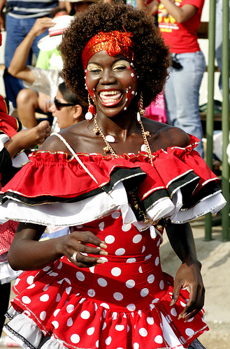

```{r setup, include=FALSE}
options(htmltools.dir.version = FALSE)
```


background-image: url(http://3.bp.blogspot.com/-r6WGkE304iI/WgWv3gwhH-I/AAAAAAAAAu4/ogsNjtvVNmYCF1WRidlMAW51Pt-BWZEZACK4BGAYYCw/s1600/cumbia%2Bcolombiana.gif)
background-position: 50% 50%
class: center, inverse
# ¿Cómo insertar un gif?
---

layout:true

background-image: url(https://rladies.org/wp-content/uploads/2016/12/R-LadiesGlobal.png),url(Logo.png)
background-position: 100% 0%, 0% 100%
background-size: 10%, 9% 
---
# ¿Cómo insertar una imagen de internet?

.center[

]
<center>
<b>Barranquilla
</b>
</center>
<br/>
<center>
Se baila al son de la cumbiamba,
<br/>
del garabato y las comparcitas.
<br/>
En la fiesta del Carnaval
<br/>
se alegra toda Barranquilla
</center>
---
layout:false

#Doble columna 
.pull-left[
.center[


]]

.pull-right[
<div style="text-align: justify">
La Negrita Puloy es el único símbolo femenino de las fiestas plenamente reconocido como tal. Este disfraz, en su aparente inocencia, trae consigo toda una historia de esclavitud, memoria de estereotipos propios de las comedias bufas cubanas y el minstrel show norteamericano. Solo que estas chicas no lo sabían mientras inventaban otra forma de hacer su carnaval.
</div>
<br>
<div style="text-align: justify">
Es como si la memoria cultural volviese disfrazada de otra manera a decirnos que miremos cómo nos comportamos aún en la actualidad cuando la «negrita» ya es otra forma de chica que ni barre ni trapea, pero que anda en tacones y con paraguas sexy.
</div>
]
---
layout:true

background-image: url(https://rladies.org/wp-content/uploads/2016/12/R-LadiesGlobal.png),url(Logo.png)
background-position: 100% 0%, 0% 100%
background-size: 10%, 9%
---
## Tablas
```{r table}
library(knitr)
knitr::kable(head(mtcars), format = "html")
```
---
layout:true

background-image: url(https://rladies.org/wp-content/uploads/2016/12/R-LadiesGlobal.png),url(Logo.png)
background-position: 100% 0%, 0% 100%
background-size: 10%, 9%
---
## Gráficos

```{r plot, echo=FALSE,include=FALSE,warning=F}
plot<-read.csv("grafico.csv",sep=";")
names(plot)[1] <- "Ciudad"
library(plotly)
p1 <- plot_ly(data =plot, y=~Ventas,color =~Ciudad,type = "box")%>%
  layout(title="Ventas", xaxis=list(title='Ciudad'),
         yaxis=list(title='Ventas por ciudad'))
```

```{r plot2, echo=FALSE,warning=FALSE,out.width= "100%", out.height="72%"}
p1

```

---
layout:true

background-image: url(https://rladies.org/wp-content/uploads/2016/12/R-LadiesGlobal.png),url(Logo.png)
background-position: 100% 0%, 0% 100%
background-size: 10%, 9%
---
# Temas

El formato xaringan::moon_reader tiene una  opción css, a la que puede pasar un vector de rutas de archivos CSS, **por ejemplo:**

```yaml
---
output:
  xaringan::moon_reader:
    css: ["default", "extra.css"]
---
```

Los usuarios han contribuido con algunos temas a xaringan . Por ejemplo, puede usar el tema metropolis.

```yaml
---
output:
  xaringan::moon_reader:
    css: [default, metropolis, metropolis-fonts]
---
```
---
layout:true

background-image: url(https://rladies.org/wp-content/uploads/2016/12/R-LadiesGlobal.png),url(Logo.png)
background-position: 100% 0%, 0% 100%
background-size: 10%, 9%

---
## Resumen y resaltado de código

```{r cars, echo = TRUE}
summary(cars)
mean(cars$speed)#<<
{{sd(cars$speed)}}
```

---
layout:true

background-image: url(https://rladies.org/wp-content/uploads/2016/12/R-LadiesGlobal.png),url(Logo.png)
background-position: 100% 0%, 0% 100%
background-size: 10%, 8% 
---
## Mapa
<style>
.html-widget {
    margin: auto;
}
</style>
```{r leaflet1,out.width= "100%", out.height="68%"}
library(leaflet)
leaflet() %>% addTiles() %>% setView(lat=30.2621, lng=-97.7382, zoom = 17)
```
---
layout: false

class: center, middle, inverse
#Muchas gracias
---